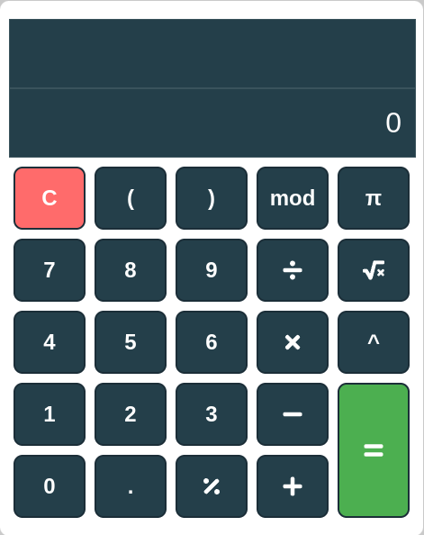

# 📟 Calculadora React

Este é um projeto de uma calculadora básica desenvolvida com React. A calculadora permite realizar operações matemáticas fundamentais, como adição, subtração, multiplicação e divisão, além de operações adicionais como módulo, porcentagem, raiz quadrada, exponenciação e utilização do valor de PI.

<div align="center">
  
</div>

## 🚀 Tecnologias Utilizadas
- ⚛️ React
- 📜 JavaScript (ES6+)
- 🌐 HTML5
- 🎨 CSS3

## ✨ Funcionalidades
- ➕ Adição (+)
- ➖ Subtração (-)
- ✖️ Multiplicação (*)
- ➗ Divisão (/)
- 🔢 Módulo (%)
- 📊 Porcentagem (%)
- 🏗️ Raiz quadrada (√)
- 📈 Exponenciação (^)
- π Valor de PI (π)

## ▶️ Como Executar o Projeto
1. Certifique-se de ter o [Node.js](https://nodejs.org/) instalado em seu computador.
2. Clone este repositório:
   ```bash
   git clone https://github.com/seu-usuario/react-calculator.git
   ```
3. Acesse a pasta do projeto:
   ```bash
   cd react-calculator
   ```
4. Instale as dependências:
   ```bash
   npm install
   ```
5. Inicie o servidor de desenvolvimento:
   ```bash
   npm start
   ```
6. Acesse `http://localhost:3000` no seu navegador para utilizar a calculadora.

## 📂 Estrutura do Projeto
```
react-calculator/
│-- src/
│   ├── components/
│   │   ├── Input.js
│   │   ├── Button.js
│   ├── App.js
│   ├── index.js
│   ├── styles.js
│-- public/
│   ├── calculadora.png
│-- package.json
│-- README.md
```

## 🤝 Contribuição
Se deseja contribuir para este projeto, siga os passos:
1. Faça um fork do repositório
2. Crie uma nova branch (`git checkout -b feature/nova-funcionalidade`)
3. Faça suas modificações e commit (`git commit -m 'Adicionando nova funcionalidade'`)
4. Envie para o seu repositório (`git push origin feature/nova-funcionalidade`)
5. Abra um Pull Request

## 📜 Licença
Este projeto está licenciado sob a licença MIT.

---

Desenvolvido por [MichelleGomes] 🚀

